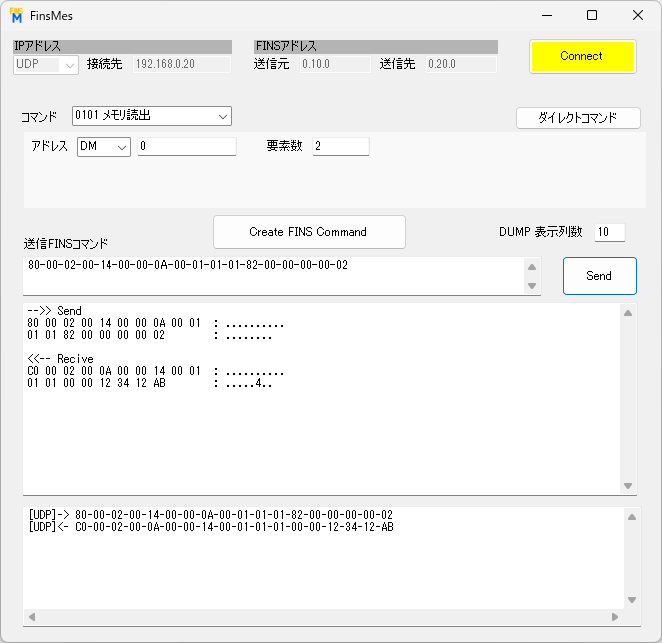

# FinsMes
OMRON FINS Message Communication  
windows11 DotNetFramework4.7.2

## 使い方
FinsMesはFINSコマンドの作成を補助して相手機器にFINSコマンドを送信するアプリケーションです

#### Connect  
UDP,TCPのどちらかを選択して接続します  
UDP接続の場合は[Connect]を押した時点では通信をしませんが、TCP接続の場合は非同期通信でPLCと接続してノードアドレス情報を取得します  
PLCと接続せずにFINSコマンドを確認するだけであれば接続する必要はありません  

FINSアドレスは "ネットワークNo.ノードNo.号機No" の順番でドットで区切って入力します  

#### FINSコマンドの作成
|コマンド|内容|オペランド||
| --- | --- | --- | --- |
|0101|	メモリ読出 |	アドレス, 要素数	|  |
|0102|	メモリ書込|	アドレス, 要素数, 書込みデータ|	※１  |
|0103|	一括書込|	アドレス, 要素数, 書込みデータ|	※１  |
|0104|	複合読出|	複数の読出しアドレス|	※２  |
|0401|	運転開始|	モニタ または 運転	 | |
|0402|	運転停止|		  ||
|0501|	CPUユニット情報|	|	  |
|0601|	CPUステータス読出し|	|	  |
|0620|	サイクルタイム|	イニシャライズ または 読出し	|  |
|0701|	時間情報読出|	|	|
|0702|	時間情報書込|	|	|
|2101|	異常解除|	故障コード	||
|2102|	異常履歴|	開始レコードNo, レコード数	||
|2103|	異常履歴クリア|		||

 

※１ 書込みデータのフォーマット

| コマンド | 書込みデータの書き方 | 例 |
|---|:---|---|
| メモリ書込 | 要素数分のワード単位(16進)でカンマ区切り | 1234,12AB |
| 一括書込 | 書込みデータは１ワード(16進) | 12AB |

 

※２ 複合読出しのフォーマット

|コマンド|アドレスの書き方|
| --- | --- |
|複合読出|アドレスはカンマ区切り|

 
アドレスの表記は D0, E0_0, W0, H0, 0 (CIOは接頭語なし)

 
手順

1. コマンドを選択します
2. オペランドを入力します
3. [Create FINS Command]ボタンを押すと送信FINSコマンド枠にFINSコマンドが作成されます  
送信FINSコマンドはバイト単位で'-'を繋げて表示します
4. 作成したFINSコマンドはそのまま送信できますが、編集することもできます  
編集する場合はバイト単位で'-'で区切ります

#### FINSコマンドの送信
手順

1. [Send]を押すと送信FINSコマンドのデータを送信します

送信したデータはDUMP枠に送信内容と受信内容を表示します

## 各項目の内容
#### 送信元, 送信先
送信元はPCが認識しているデバイスのIPアドレスから選択します  
FINSアドレスは "ネットワークNo.ノードNo.号機No" の順番でドットで区切って入力します

#### [Connect]
UDP接続の場合は[Connect]を押した時点では通信をしませんが、TCP接続の場合は非同期通信でPLCと接続してノードアドレス情報を取得します  
PLCと接続せずにFINSコマンドを確認するだけであれば接続する必要はありません

#### FINSコマンドを選択します
コマンドによって下のパラメータ入力エリアの内容が変わります  
#### [Create FINS Command]
上で設定したFINSアドレス、コマンドとパラメータをFINSコマンドに変換して下の送信FINSコマンドに表示します
#### 送信FINSコマンド
送信するFINSコマンドをバイト単位で組み立てて'-'で区切ります

## ダイレクトコマンド
ダイレクトコマンドはこのアプリ内のクラスFinsMessageのメソッドをテストします

#### テストするメソッド
|メソッド|内容|
|---|---|
|read("D0", 1000)	|D0から1000CH読出し|
|write("D1000", writedata)	|D1000からwritedataを書込み(1000CH分)|
|fill("D2000", 100, filldata)	|D2000からD2099にfilldataを書込み（filldata=100)|
|MultiRead("D0,D10,D50")	|D0,D10,D50の値を読出し|
|ReadUnitData()	|CPUユニットデータ読出し|
|ReadUnitStatus()	|CPUステータス読出し|
|ReadCycleTime()	|サイクルタイム読出し|
|Clock()	|時間情報読出し|
|SetClock()	|時間情報書込み(PCの時間)|
|stop()	|運転停止|
|ErrorClear()	|異常解除|
|ErrorLogRead()	|異常履歴読出し|
|ErrorLogClear()	|異常履歴クリア|
|run(0x02)	|運転開始 モニタモード|

#### テストするデータ形式変換メソッド
|メソッド|内容|
|---|---|
|WordToBin(readdata)	|ゼロ埋めビット表記文字列|
|BitArray型に変換	|読み出したバイト配列をBitArrayに変換|
|toBoolArray(readdata)	|BOOL型配列|
|toInt16(readdata)	|INT型配列(short)|
|toInt32(readdata)	|DINT型配列(int)|
|toInt64(readdata)	|LINT型配列(long)|
|toUInt16(readdata)	|UINT型配列(ushort)|
|toUInt32(readdata)	|UDINT型配列(uint)|
|toUInt64(readdata)	|ULINT型配列(ulong)|
|toFloat(readdata)	|REAL型配列(float)|
|toDouble(readdata)	|LREAL型配列(Double)|
|toString(readdata)	|文字列型|
